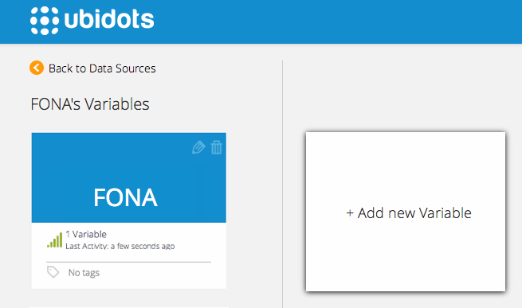

# Adafruit FONA MiniGSM

In this tutorial we’ll explain how to send analog values to Ubidots using the FONA module.

## Introduction

Adafruit FONA MiniGSM is "an all-in-one cellular phone module that lets you add voice, text, SMS and data to your project in an adorable little package".

## Components

* [FONA](http://www.adafruit.com/product/1963):
	
    
* A micro-controller board to manage the FONA through an UART interface. We’ll use an Arduino in this case. You can also find a [basic ArduinoFONA tutorial in Adafruit's website](http://www.adafruit.com/product/1963). The pin connection for an Arduino would look like this:

	  * Vio       --> 5V (or 3V, with a 3V logic Arduino)
	  * GND       --> GND
    * KEY  --> GND 
	  * FONA_RX   --> Pin 2
	  * FONA_TX   --> Pin 3
	  * FONA_RST  --> Pin 4
	  
 
## Preparing your Ubidots Account

Create a Data source called "FONA" and then a variable called "My Variable":

1. [As a logged in user](http://app.ubidots.com/accounts/signin/) navigate to the "Sources" tab.
	
    
2. Create a data source called "My Variable" by clicking on the orange button located in the upper right corner of the screen:
	
    
3. Click on the created Data Source and then on "Add New Variable":
	
    
4. Repeat this process for every variable you wish to create. Take note of every variable's ID; we'll need it later to include in our code:
	
    
5. Create a token under "My Profile" tab. We'll need it later for our code:
	
    
## Coding

To be able to compile this code, you'll need the FONA library for Arduino. [You can find it in Adafruit's website](https://learn.adafruit.com/adafruit-fona-mini-gsm-gprs-cellular-phone-module/arduino-test#download-adafruit-fona).

**NOTE**: Because the FONA Library is a work in progress from Adafruit, we can't guarantee that this code will always work. We'll do our best to keep it up to date following Adafruit's updates.

This example updates 4 variables in Ubidots, but you can easily adapt it to fit your project's variables.

```c++

	/*

  Sample code to send data from an Arduino to four Ubidots variables using the Adafruit's FONA

  Components:
  * Arduino Uno
  * Adafruit FONA

  Created 15 Jan 2015
  This code is based on the Adafruit FONAtest Example
  and was modified and perfeccioned by Mateo Velez - Metavix for Ubidots.

  This code is in the public domain.

  */


#include <SoftwareSerial.h>
#include "Adafruit_FONA.h"
#include <stdlib.h>


// Pin connections:
#define FONA_RX 2
#define FONA_TX 3
#define FONA_RST 4
// Ubidots token and variables
#define TOKEN  "CCN8FrVulRYGulPTkbaiR9Myx8qN2o"
#define id1  "569801a77625423a8d09dc3f"
#define id2  "568d8a0a76254218b18479ec"
#define APN "web.colombiamovil.com.co"


// or comment this out & use a hardware serial port like Serial1 (see below)
SoftwareSerial fonaSS = SoftwareSerial(FONA_TX, FONA_RX);
Adafruit_FONA fona = Adafruit_FONA(FONA_RST);

void setup() {
  //For FONA MODULE
  Serial.begin(19200);
  fonaSS.begin(9600);
  delay(2000);
}

void loop() {
  checkFona();
  gprsOnFona();
  save_value(344.32,id1);
  Serial.println(get_value(id2));
  gprsOffFona();
  delay(6000);

}
void save_value(float value, char* myid){
  uint16_t statuscode;
  int16_t length;
  char* url = (char *) malloc(sizeof(char) * 300);
  char* data = (char *) malloc(sizeof(char) * 50);
  char val[8];
  String(value).toCharArray(val,9);
  sprintf(url,"things.ubidots.com/api/v1.6/variables/%s/values?token=%s", myid, TOKEN);
  sprintf(data,"{\"value\":%s}", val);  
  Serial.print(F("http://"));
  Serial.println(url);
  Serial.println(data);
  Serial.println(F("****"));
  while (!fona.HTTP_POST_start(url, F("application/json"), (uint8_t *) data, strlen(data), &statuscode, (uint16_t *)&length)) {
    Serial.println("Failed!");
  }
  free(url);
  free(data);
  Serial.println(F("\n****"));
  fona.HTTP_POST_end();
}
float get_value(char* myid){
  uint16_t statuscode;
  int16_t length;
  char* url = (char *) malloc(sizeof(char) * 500);
  int i = 0;
  sprintf(url,"things.ubidots.com/api/v1.6/variables/%s/values?token=%s&page_size=1", myid, TOKEN);
  Serial.print(F("http://"));
  Serial.println(url);
  Serial.println(F("****"));
  while (!fona.HTTP_GET_start(url, &statuscode, (uint16_t *)&length)) {
    Serial.println("Failed!");
  }
  while(length>0){
    while(fonaSS.available()){
    url[i] = fonaSS.read();
    i++;
    length=length-1;
    }
    delay(10);
  }
  url= strstr(url,"\"value\":");
  String raw(url);
  int bodyPosinit =9+ raw.indexOf("\"value\":");
  int bodyPosend = raw.indexOf(", \"timestamp\"");
  raw.substring(bodyPosinit,bodyPosend).toCharArray(url, 10);
  return atof(url);  
}
void checkFona(){
  // See if the FONA is responding
  if (! fona.begin(fonaSS)) {           // can also try fona.begin(Serial1)
    Serial.println(F("Couldn't find FONA"));
    while (1);
  }
  Serial.println(F("FONA is OK"));
  //configure a GPRS APN
  fona.setGPRSNetworkSettings(F(APN), F(""), F(""));
}
void gprsOnFona(){
  while(!fona.enableGPRS(true));
  Serial.println(F("Turn on"));
}

void gprsOffFona(){
  while (!fona.enableGPRS(false));
  Serial.println(F("Turn off"));
}

```


## Wrapping it up

In this guide we learned how to read analog inputs from the Arduino UNO and send these values through the FONA to Ubidots. After getting familiar with it, you can modify your hardware setup to send readings from any other type of sensors attached to it.

## More projects...

Check out other cool projects using Ubidots:
 
* :ref:`devices/arduino-gprs`
* :ref:`devices/arduino-wiznet`
* :ref:`devices/dragino`
