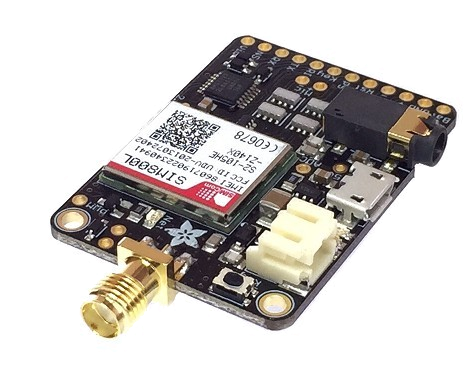

# Adafruit FONA MiniGSM

Adafruit FONA MiniGSM is "an all-in-one cellular phone module that lets you add voice, text, SMS and data to your project in an adorable little package".

## Introduction

Here you will learn how to send a simple value to the Ubidots API and how to get the last value of one variable of your Ubidots account,using an Adafruit FONA device and Ubidots library.

## Components

* [Arduino uno](http://arduino.cc/en/Main/ArduinoBoardUno)
  

* [FONA](http://www.adafruit.com/product/1963):
	

* Arduino IDE 1.6.0 or higher:
    * [Windows](https://www.arduino.cc/download_handler.php?f=/arduino-1.6.7-windows.exe)
    * [Mac](https://www.arduino.cc/download_handler.php?f=/arduino-1.6.7-macosx.zip)
    * [Linux 32 Bits](https://www.arduino.cc/download_handler.php?f=/arduino-1.6.7-linux32.tar.xz)
    * [Linux 64 Bits](https://www.arduino.cc/download_handler.php?f=/arduino-1.6.7-linux64.tar.xz)

* [Ubidots Arduino FONA library](https://github.com/ubidots/ubidots-arduino-gprs/archive/1.0.0.zip)

* [Adafruit_FONA library](https://github.com/adafruit/Adafruit_FONA_Library/archive/1.3.0.zip) 
    
## First steps

First of all you will need to set up Ubidots_FONA and Adafruit_FONA library into Arduino IDE, for this please go to Arduino IDE click on Sketch -> Include Library -> Add .ZIP Library. Now go where you saved Ubidots_FONA and Adafruit_FONA library and select everyone.

Now wire ever pin like this:

    * Vio –> 5V (or 3V, if your Arduino has 3V logic)
    * GND –> GND
    * FONA_RX –> Pin 2
    * FONA_TX –> Pin 3
    * FONA_RST –> Pin 4
    * FONA_KEY –> Pin 7
    * FONA_PS –> Pin 8

**NOTE**: Because the FONA Library is a work in progress from Adafruit, we can't guarantee that this code will always work. We'll do our best to keep it up to date following Adafruit's updates.

## Examples with FONA

When you have done with the first steps go to Sketch -> examples -> Ubidots_FONA and you will see two examples:

### Ubidots save value

This example is to save a variable value to the Ubidots API. The code inside the library is like this:

```c++
#include <Ubidots_FONA.h>


#include <SoftwareSerial.h> 
#include <Adafruit_FONA.h>


#define APN  ""  // The APN of your operator
#define USER ""  // if your apn doesnt have username just leave it ""
#define PASS ""  // if your apn doesnt have password just leave it ""
#define TOKEN "Your_token_here"  // Replace it with your Ubidots token
#define ID "Your_id_here" // Replace it with your Ubidots' variable ID

Ubidots client(TOKEN);  
  
void setup() {
  Serial.begin(115200);
  delay(2000);
  client.gprsNetwork(F(APN),F(USER),F(PASS));
}

void loop() {
  float value = analogRead(A0);  // Reading analog pin A0
  client.flushSerial();
  client.checkFona();
  client.gprsOnFona();
  client.saveValue(ID, value);  
  delay(1000); 
}
```


### Ubidots get value

This example is to get the last value of a variable from your Ubidots account. The code inside the library is like this:

```c++
#include <Ubidots_FONA.h>
#include <SoftwareSerial.h> 
#include <Adafruit_FONA.h>

#define APN  ""  // The APN of your operator
#define USER ""  // if your apn doesnt have username just leave it ""
#define PASS ""  // if your apn doesnt have password just leave it ""
#define TOKEN "Your_token_here"  // Replace it with your Ubidots token
#define ID "Your_id_here" // Replace it with your Ubidots' variable ID

Ubidots client(TOKEN);  
  
void setup() {
  Serial.begin(115200);
  delay(2000);
  client.gprsNetwork(F(APN),F(USER),F(PASS));
}

void loop() {
  client.flushSerial();
  client.checkFona();
  client.gprsOnFona();
  float value = client.getValue(ID);  
  delay(1000); 
  Serial.println(value);
}

```

## Conclusion

With Ubidots_FONA library you could send a value from Arduino UNO to Ubidots API and you could get the last value of one of your variables of your Ubidots account.

## More projects...

Check out other cool projects using Ubidots:
 
* :ref:`devices/arduino-gprs`
* :ref:`devices/arduino-wiznet`
* :ref:`devices/dragino`
