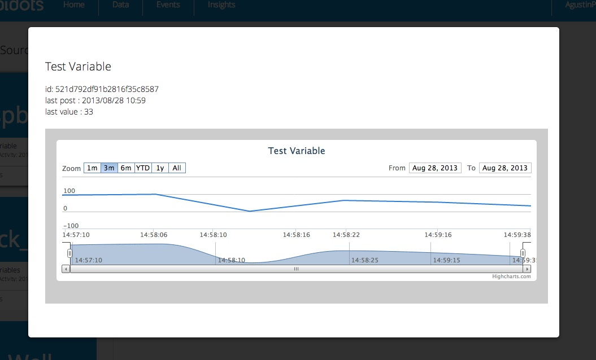

# Raspberry Pi - WiFi/Ethernet

Learn how to setup your Raspberry Pi to send data to Ubidots using our
python library.

## Introduction

Raspberry Pi has become a widely used device, not only for prototyping and educational purposes, but also for production projects within companies.

Best described as a pocket-size $25 computer, it features all the components and peripherals needed to perform most tasks your desktop PC would do, like spreadsheets, word-processing and games.

Besides its small size, low cost and fully operational Linux OS, the greatest difference from your Destkop PC lies in its ability to interact with other peripherals through GPIO pins (General Purpose Input/Ourput Pins).

This allows you to code pretty robust hardware applications without having to be an expert in embedded electronics.

At the end of this guide you’ll be able to send data values from your Pi to Ubidots.

## Components

To complete this tutorial, you'll need:

* Raspberry Pi Model B (512MB)
* A Raspberry Pi compatible WiFi dongle (Edimax EW-7811Un in this case)
* 4 GB SD Card
* Micro USB power adaptor 


## Libraries

This tutorial implements the following library:

* Python :ref:`Ubidots Client <libraries_python>`.


## Setup your Raspberry Pi

If you have already done a basic setup of your Raspberry Pi you can jump this section, otherwise follow these steps:

* Download the Raspberry Pi operating system, we recommend [Raspbian Wheezy](http://www.raspberrypi.org/downloads).

* Unzip the file and you'll end up with a large IMG file: DON'T COPY AND PASTE THIS FILE INTO YOUR SD CARD, because it won't
   work. You'll need to write it properly to the SD card by following these steps according to your operating system:

   * [MacOS](http://ivanx.com/raspberrypi/)
   * [Linux](http://elinux.org/RPi_Easy_SD_Card_Setup#Using_Linux_.28including_on_a_Pi.21.29)
   * [Windows](http://elinux.org/RPi_Easy_SD_Card_Setup#Using_Windows_7_or_Windows_XP)

* Plug a keyboard and a monitor through the HDMI or TV/Analog ports.

**seealso**

    [Quick Start Guide](http://www.raspberrypi.org/quick-start-guide) from the Raspberry Pi official site .

## Configuration


1. Connecting your Raspberry Pi through WiFi.
   Your Raspberry Pi already has an Ethernet port, however, it can be turned into a wireless device by adding a USB WIFI dongle.
    
  
      **Figure 1:** Raspberry pi with USB WIFI dongle from EDIMAX

      First, we'll need to make sure your device is connected to the web through your local WIFI network:

2. Plug the USB WiFi Dongle, then restart your RasPi.

3. Login to the device using your credentials, typically as follows:
```bash
   
       user: pi 
       password: raspberry
```
4. Open this file from the console:
```bash

  $ sudo nano /etc/network/interfaces
```
5. Modify the file so that it looks like this:
```bash
   
      auto lo
      iface lo inet loopback
  
      auto eth0
      iface eth0 inet dhcp
  
      auto wlan0
      iface wlan0 inet dhcp
      wpa-ssid "YOUR WIFI NETWORK NAME"
      wpa-psk "YOUR WIFI PASSWORD"
```
5. Reboot your device.
```bash

      $ sudo reboot
```
6. Verify the WiFi connection. You must be able to see an IP address assigned to the 'wlan0' interface.
```bash

      $ sudo ifconfig wlan0
```
## Configure your Raspberry Pi to use our Python API Client.

1. Let's make sure your device is up to date so that it has the latest
   python tools (be aware that this will take a while):
```bash
   
      $ sudo apt-get update
      $ sudo apt-get upgrade
```
2. Download the pip installer and install Ubidots' Python library
```bash

    $ sudo apt-get install python-setuptools
    $ sudo easy_install pip
    $ sudo pip install ubidots
```
## Setup a test Variable in Ubidots

1. As a [logged in user](http://app.ubidots.com/accounts/signin/) navigate to the "Data" tab.

2. Create a Data Source by clicking on the orange icon on the right. Then create a variable within that Data Source.

3. Take note of the variable's ID to which you want to send data. For this example we'll use a variable with the ID:
   "521d792df91b2816f35c8587"

4. Take note of your [API key](http://app.ubidots.com/userdata/api/).

## Send data to Ubidots


Coming back to your Raspberry Pi:

1. Create a directory called "ubidots" where you can put this and future scripts:
```bash

      $ mkdir ubidots
```
2. Create a python script using your favorite text-editor. We'll use "nano" in this case:
```bash

      $ cd ubidots
      $ nano ubi-test.py
```
   Put the following code into the created file. Please note the 
   fields where you should put your API key and your variable ID.
```python

      from ubidots import ApiClient
      import random

      #Create an "API" object

      api = ApiClient("7fj39fk3044045k89fbh34rsd9823jkfs8323")

      #Create a "Variable" object

      test_variable = api.get_variable("521d792df91b2816f35c8587")

      #Here is where you usually put the code to capture the data, either through your GPIO pins or as a calculation. We'll simply put a random value here:

      test_value = random.randint(1,100)

      #Write the value to your variable in Ubidots

      test_variable.save_value({'value':test_value})
```
3. Run the code several times to send some random values to the cloud:

```bash

      $ python ubi-test.py
```
  You should now see some data-points in your browser!
  
   **Figure 2:** Your data in Ubidots

  Once your data is in the cloud, it's all down the hill. You can trigger events according to your data, create insights to share, etc.

## Wrapping it up

In this sample project we were able to send an arbitrary value to the Ubidots service.
You can use Ubidots to stream any type of time-series data, such as
temperature levels, humidity levels, GPS, etc. For instance, check out these other examples:

* [Sending motion sensor data to the cloud with a Raspberry Pi](http://blog.ubidots.com/building-a-people-counter-with-raspberry-pi-and-ubidots)
* :ref:`Tracking light sensor data to the cloud with an Arduino <devices/arduino-wifi>`